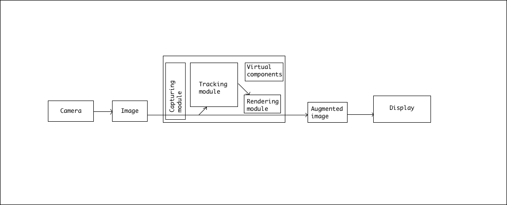

# Introduction

**Augmented Reality** is projection of virtual world but fused with reality which makes it different from **Virtual Reality** where the actual environment is hidden and it simulates a physical presence in virtual environment.

> Given below is an abstract from a document which you can find [here](http://www.vtt.fi/inf/pdf/science/2012/S3.pdf).

Augmented Reality combines real world and digital data or you can say that it combines the field of computer vision and computer graphics. Explaining further, computer vision applies to marker detection, tracking the position of the marker and motion detection whereas computer graphics applies to the photometric registration (matching the appearance of 3D objects in virtual environment to the actual environment) and interactive animations. Its all about enhancing the user perception.

## Architecture

  

The **capturing module** captures the **image** from the **camera**. The **tracking module** calculates the correct location and orientation for virtual overlay. The **rendering module** combines the original image and the **virtual components** using the calculated **pose** and then renders the **augmented image** on the display.

The tracking module is the important and heart of the architecture. It calculates the relative pose of the camera in real time. The term pose means the **six degrees of freedom position** i.e **3D orientation and 3D location of an object**. It also enables the system to add virtual components as part of the real scene.

Now to calculate the pose, markers are used along with the **projective geometry**.

This project aims to bridge AR with React to create AR on the web with ease. It uses AR.js behind the scenes to describe the **AR context** and configure the **AR controller** which we will cover in more detail in [concepts](./concepts.md) section.

> If you're interested then you can read the document linked above about the theory of augmented reality.

## Why React?

* Components 🔥
* Ability to sync AR lifecyle with React lifecyle hooks
* Clean and minimal API
* Declaratively controlling the render loop
* Easy to create AR content that can be used and integrated anywhere

[Continue to concepts section](./concepts.md)
